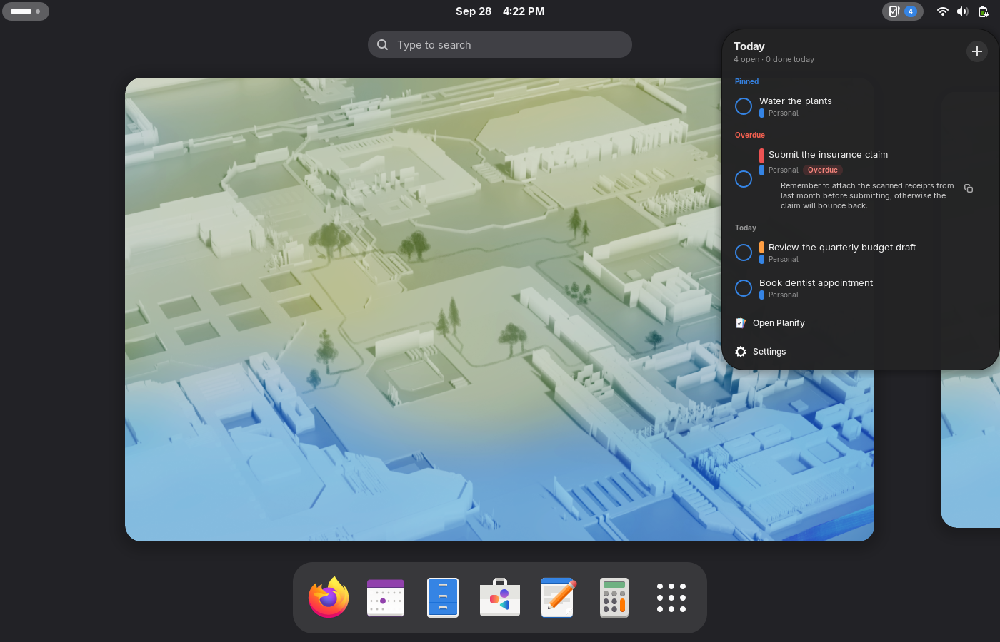

# Planify Quick View — GNOME Shell panel extension

An unofficial GNOME Shell extension that puts [Planify](https://github.com/alainm23/planify)
in your top bar. Clicking the panel button opens a quick-view card — due-today
and overdue tasks, live from the Planify app — styled like a native GNOME
quick-settings card. Click a task to complete it, click outside or press
`Escape` to dismiss it (it animates back into its panel icon).

```
┌──────────────────────────────┐
│ Today                    [+] │
│ 5 open · 2 done today        │
│ ○ Restart learning Chinese…  │
│   ● Inbox          Overdue   │
│ ○ Help Cathy find job        │
│   ● Inbox             14:00  │
│ …                            │
│ ⬒ Open Planify               │
└──────────────────────────────┘
```

## Screenshots

Popup with Pinned / Overdue / Today sections (fixture data):


Fold-out description with copy button:



Settings window:


## Features

- Due-today and overdue tasks in the top bar, with a live open-task badge
  (`count`, `dot`, or hidden).
- Complete a task from the popup; an undo window (default 3 s) catches
  misclicks. Recurring tasks advance correctly because completion is
  delegated to the Planify app.
- Click a task title to fold out its description — selectable text with a
  copy button; click again to fold it back.
- Inline quick-add: type a title, press `Enter`, the task lands in Today.
- Global keybinding (off by default) to toggle the popup.

## How it works

- The extension runs inside `gnome-shell` (GJS) and renders the card with
  native `St` widgets — a GTK4 app window cannot be embedded in the shell,
  so data moves, not pixels.
- Tasks come from the **Planify app over D-Bus** — the app exports
  `GetTasks` and a `TasksChanged` signal on its
  `io.github.alainm23.planify` interface. The extension never touches
  Planify's files.
- **Planify must be running** for the card to show tasks. When it isn't,
  the card shows a launch hint instead; every click path (footer, task
  rows) starts the app.
- Completing a task is delegated to the Planify app's `complete` GAction,
  so recurring tasks advance and sync stays consistent.

## Install

```bash
git clone https://github.com/YacineSahli/Planify-Gnome-Extension.git
cd Planify-Gnome-Extension
./install.sh --enable     # install + enable; live on the next session start
./install.sh --uninstall  # fully remove
./build.sh                # build dist/planify-quick-view.zip for EGO upload
```

`install.sh` uses `gnome-extensions install` so a *running* shell registers
the files; the shell scans new extension directories only at session start,
so the panel button appears after your next login (this is standard GNOME
behavior for local zip installs — extensions.gnome.org installs are the
only ones that load instantly).

Requirements: GNOME Shell 50 (uses the 45+ ESM API; see
`src/metadata.json`), and **Planify running** (Flatpak or native) with the
`GetTasks` D-Bus API — present in Planify's current git main
([the PR](https://github.com/alainm23/planify) adds it to
`Services.DBusServer`).

## Settings

Everything is configurable in the **Settings window** — click the panel
icon, then the gear row at the bottom of the popup (or `gnome-extensions
prefs planify-quick-view@yacinesahli.github.io`).

### Settings reference (gsettings)

Schema `org.gnome.shell.extensions.planify-quick-view`:

| Key | Default | Purpose |
|---|---|---|
| `max-rows` | `12` | Rows shown before the list scrolls |
| `complete-delay-seconds` | `3` | Undo window after clicking a checkbox; click again to cancel. 0 = complete instantly |
| `animation-duration` | `0` | 0 = built-in (220 ms open / 160 ms close) |
| `debug-dbus` | `false` | Expose test D-Bus interface (see below) |
| `toggle-quick-view` | `[]` | Global keybinding to toggle the popup |
| `badge-mode` | `"count"` | Panel badge: `count`, `dot`, or `hidden` |

```bash
gsettings set org.gnome.shell.extensions.planify-quick-view \
  toggle-quick-view "['<Super><Shift>p']"
```

## Testing

```bash
./tests/e2e-nested.sh    # functional suite in an isolated headless shell
                         # (verifies load, not-running state, state machine)
./tests/e2e-real.sh      # interactive suite for a graphical session with
                         # Planify running (real clicks via ydotool, Escape,
                         # outside click, live data)
./tests/dbus-api-live.sh # app-side: GetTasks/TasksChanged contract in an
                         # isolated session (needs the Sdk-built app, see
                         # the script header)
```

`debug-dbus` exposes `io.github.yacinesahli.PlanifyQuickView` on the
session bus (`Toggle`, `Open`, `Close`, `Status`, `Capture`, `Repaint`) —
a test hook, off by default.

## Scope, known limitations

- **Requires Planify running**: tasks are read over D-Bus from the app, so
  with Planify closed the card shows a launch hint instead of (possibly
  stale) data.
- **Read-only quick view**: completing tasks works through the app;
  editing/creating happens in Planify (the header **[+]** inline input adds
  a task due today; everything else opens Planify).
- "Today" semantics come from the app's own `GetTasks` payload; ordering is
  rebuilt client-side (Pinned / Overdue / Today, then due date, priority).
- Keyboard navigation between task rows (arrow keys) is not implemented
  yet; `Escape` and outside-click dismissal are handled by the shell.

## Credits & license

[Planify](https://github.com/alainm23/planify) is a to-do app by
[Alain M.](https://github.com/alainm23) — this extension is an independent
companion project and is not affiliated with or endorsed by Planify.

GPL-3.0-or-later, same as Planify. © 2026 Yacine Sahli.
